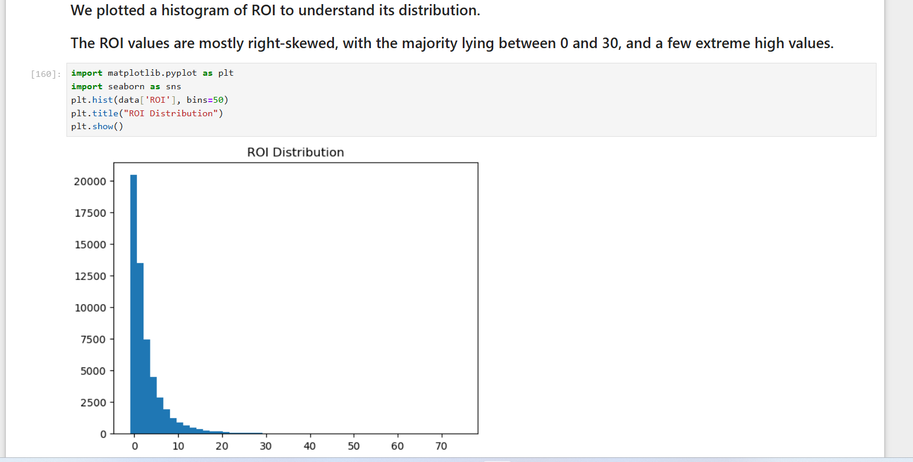
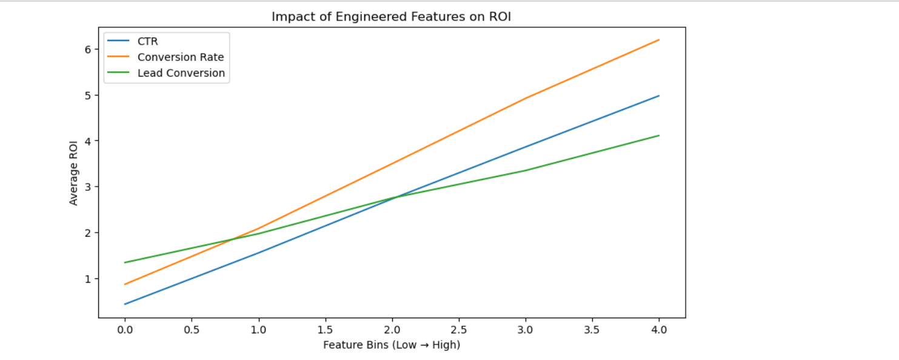
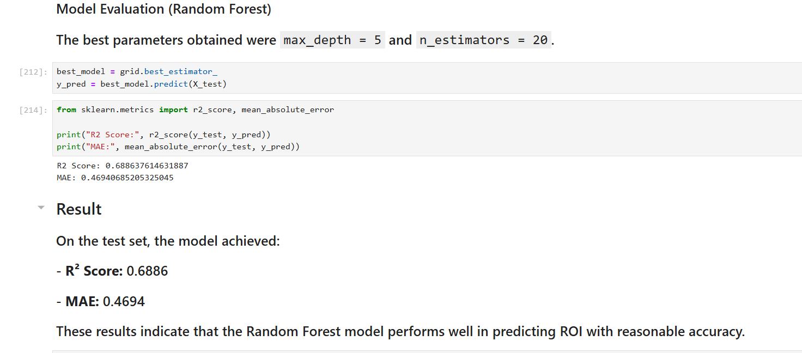

# Nykaa Marketing Campaign ROI Prediction

A data analytics and machine learning project focused on analyzing marketing campaign performance and predicting Return on Investment (ROI).

---

## Overview
This project analyzes a large-scale marketing campaign dataset to understand key performance drivers and predict ROI. It includes data preprocessing, feature engineering, exploratory data analysis, and machine learning modeling.

---

## Objective
- Analyze campaign performance metrics such as impressions, clicks, leads, and conversions  
- Identify key factors influencing ROI  
- Build predictive models to estimate ROI accurately  

---

## Tools & Technologies
- Python (Pandas, NumPy)  
- Data Visualization (Matplotlib, Seaborn)  
- Machine Learning (Scikit-learn, XGBoost)  

---

## Project Workflow
1. Data Loading and Cleaning  
2. Exploratory Data Analysis (EDA)  
3. Feature Engineering (CTR, Conversion Rate, Lead Conversion)  
4. Outlier Handling using IQR method  
5. Log Transformation to reduce skewness  
6. Correlation Analysis and feature selection  
7. Encoding categorical variables  
8. Model Building using Random Forest and XGBoost  
9. Hyperparameter tuning using GridSearchCV  
10. Model evaluation and comparison  

---

## Results
- Random Forest:
  - R² Score: **0.6886**
  - MAE: **0.4694**
- XGBoost:
  - R² Score: **0.6782**
  - MAE: **0.4828**

Random Forest performed slightly better and was selected as the final model.

---

## Key Insights
- Revenue has a strong positive impact on ROI  
- Acquisition Cost negatively affects ROI  
- Conversion-related metrics (CTR, Conversion Rate, Lead Conversion) are key drivers  
- Social Media and SEO campaigns show higher ROI compared to Email campaigns  

---

## Project File
- `nykaa_campaign_analysis.ipynb` → Full analysis and model implementation  

---

## Conclusion
Feature engineering and proper preprocessing significantly improved model performance. The Random Forest model achieved strong predictive accuracy and can be used to support data-driven marketing decisions.

---

## Future Improvements
- Advanced hyperparameter tuning  
- Deployment of model for real-time prediction  
- Dashboard creation using Power BI for business use  

---

## Screenshots
 - 
 - 
 - 
